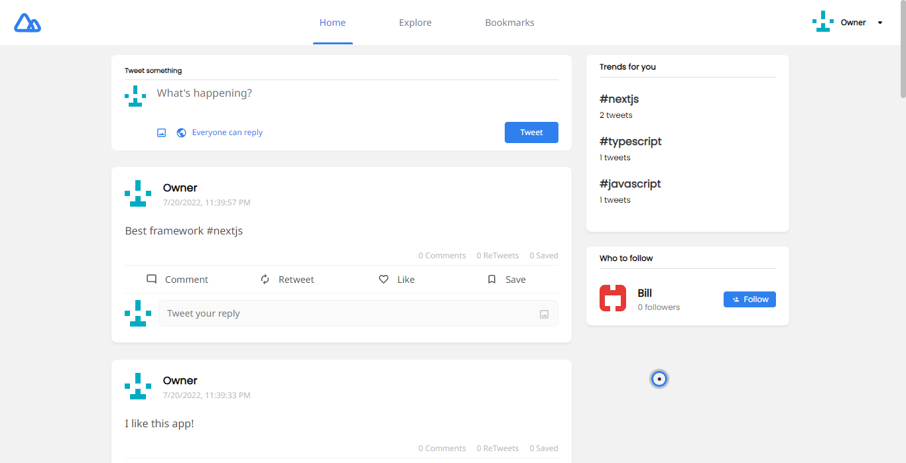

# Tweeter

Twitter clone with Github and Gitlab authentication. Solution for a [challenge](https://devchallenges.io/challenges/rleoQc34THclWx1cFFKH) from [devchallenges.io](https://devchallenges.io/). The application is made in NextJS for the possibility of doing the frontend and backend in the same project, TypeScript for type safety, Redux for better and more scalable state management, Framer Motion to add animations to the frontend, NextAuth to implement authentication in an easy and robust way, PostgreSQL as database for its great scalability and Prisma ORM to manage the database in a more productive way.



## Prerequisites

Install the dependencies.

```bash
npm install
```

Create an `env.local` file and add the environment variables, see `.env.example`.

## Scripts

This creates a local server and rebuild it when you make changes.

```bash
npm run dev
```

This creates a production-ready version of the app and can be deployed to the web.

```bash
npm run build
```

This creates a template for the enviroment variables in a `.env.example` file

```bash
npm run gen-env-template
```
